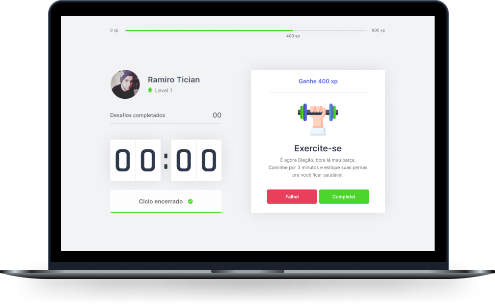

<h1 align="center">
  
</h1>

  <a href="#-stack">Stack</a>&nbsp;&nbsp;&nbsp;|&nbsp;&nbsp;&nbsp;
  <a href="#-project">Project</a>&nbsp;&nbsp;&nbsp;|&nbsp;&nbsp;&nbsp;
  <a href="#-how-to-run">How to run</a>&nbsp;&nbsp;&nbsp;|&nbsp;&nbsp;&nbsp;
  <a href="#-license">License</a>

  

 

  

## ✨ Stack

This project was developed with the following techs:

- [React](https://reactjs.org)
- [Next.js](https://nextjs.org/)
- [TypeScript](https://www.typescriptlang.org/)

## 💻 Project

move.it is an app that combines the Pomodoro technique with physical exercises for those who spend a lot of time in front of the computer.

## 🚀 How to run

- Clone the repo
- Install the dependencies with `yarn`
- Run the app with `yarn dev`

Now you can access [`localhost:3000`](http://localhost:3000) from your browser.

## 📄 License

This project is under MIT license. Check the file [LICENSE](LICENSE.md) for more details.

